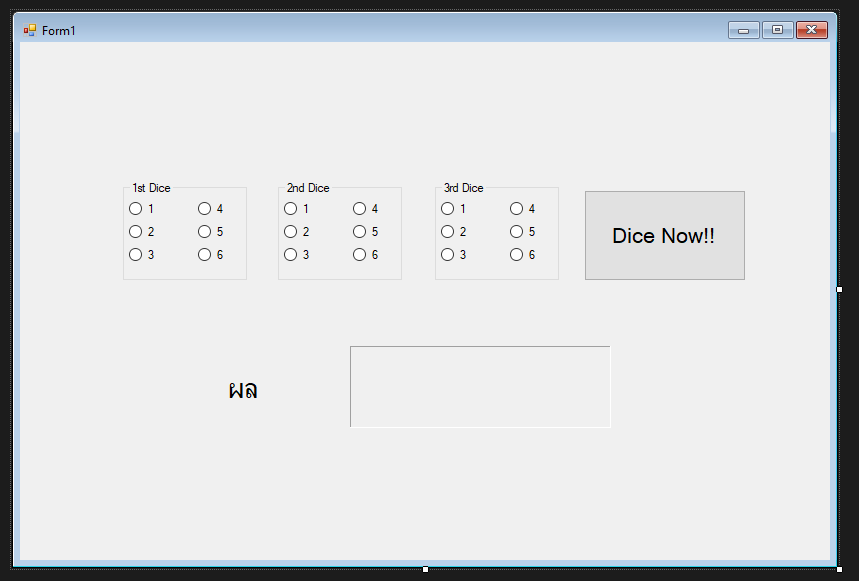

# Hi-LOW Program !!

---

## สร้าง UI interface ตามที่โจทย์ให้มา



---?color=linear-gradient(180deg, white 0%, black 100%)
@title[Customize Slide Layout]

@snap[west span-50]
## อธิบาย UI !!
@snapend

@snap[east span-50]

@snapend

@snap[south span-100 text-white]
จะมีช่องลูกเต๋าทั้งหมด 3 ชุด ปุ่มกดเพื่อยืนยัน ผลลัพธ์ และผลรวมที่เราเลือกมาจากลูกเต๋าทั้ง 3 ชุด
เมื่อสร้างแล้ว ให้ดับเบิลคลิกที่ปุ่ม Dice Now !! เพื่อสร้าง function สำหรับการดำเนินการ 
@snapend

---
# Let's write the code !!


---

@snap[north-east span-100 text-06 text-gray]
Let's write the code !!
@snapend

```c#
int Result = 0; //สร้างตัวแปรเพื่อรอรับค่าที่เราเลือก เพื่อนำไปคำนวนต่อไป
```

@[1]

@snap[south span-100 text-black]
ทำการสร้างตัวแปรที่ชื่อ result ที่รับค่าเป็น Int แล้วระบุให้ result มีค่าเป็น 0
@snapend


---

@snap[north-east span-100 text-06 text-gray]
Let's write the code !!
@snapend


```c#
if (dice1_1.Checked) Result += 1;//ถ้าเลือก 1 ที่ช่องลูกเต๋า 1 จะเพิ่มค่าให้กับ Result เพิ่มขึ้น 1
if (dice1_2.Checked) Result += 2;//ถ้าเลือก 2 ที่ช่องลูกเต๋า 1 จะเพิ่มค่าให้กับ Result เพิ่มขึ้น 2
if (dice1_3.Checked) Result += 3;//ถ้าเลือก 3 ที่ช่องลูกเต๋า 1 จะเพิ่มค่าให้กับ Result เพิ่มขึ้น 3
if (dice1_4.Checked) Result += 4;//ถ้าเลือก 4 ที่ช่องลูกเต๋า 1 จะเพิ่มค่าให้กับ Result เพิ่มขึ้น 4
if (dice1_5.Checked) Result += 5;//ถ้าเลือก 5 ที่ช่องลูกเต๋า 1 จะเพิ่มค่าให้กับ Result เพิ่มขึ้น 5
if (dice1_6.Checked) Result += 6;//ถ้าเลือก 6 ที่ช่องลูกเต๋า 1 จะเพิ่มค่าให้กับ Result เพิ่มขึ้น 6
```

@[1-6]

@snap[south span-100 text-black]
ทำการตรวจสอบว่า ถ้าเลือกเช็คช่องไหน ให้บวกค่าใส่ตัวแปร result ตามจำนวนที่ระบุไว้ 
แล้วเขียนโค๊ดชุดนี้ซ้ำ ตามจำนวนชุดของลูกเต๋า โดยให้ตัวแปร Dicex_x เป็นชื่อของ radiobox ที่เราตั้งไว้
@snapend


---

@snap[north-east span-100 text-06 text-gray]
Let's write the code !!
@snapend

```c#
int Result = 0; //สร้างตัวแปรเพื่อรอรับค่าที่เราเลือก เพื่อนำไปคำนวนต่อไป
```

@[1]

---

@snap[north-east span-100 text-06 text-gray]
Let's write the code !!
@snapend


```c#
Result_Total.Text = Result.ToString();//แสดงผลลัพธ์ที่ได้ โดยเอาตัวแปร Result มาแสดงผล
//ตรวจสอบค่าที่อยู่ในตัวแปร Result 
if (Result > 11)TextResult.Text = "สูง";//หาก Result มีค่ามากกว่า 11 ให้แสดงผลใน Lable ที่ชื่อ TextResult เป็น "สูง"
else if (Result < 11) TextResult.Text = "ต่ำ";//หาก Result มีค่าน้อยกว่า 11 ให้แสดงผลใน Lable ที่ชื่อ TextResult เป็น "ต่ำ"
else if(Result == 11)TextResult.Text = "Hi-Low";//หาก Result มีค่าเท่ากับ 11 ให้แสดงผลใน Lable ที่ชื่อ TextResult เป็น "Hi-Low"
```

@[1]
@[2-4]

@snap[south span-100 text-black]
ทำการตรวจสอบค่าตัวเลข ที่อยู่ในตัวแปร result 
@snapend
